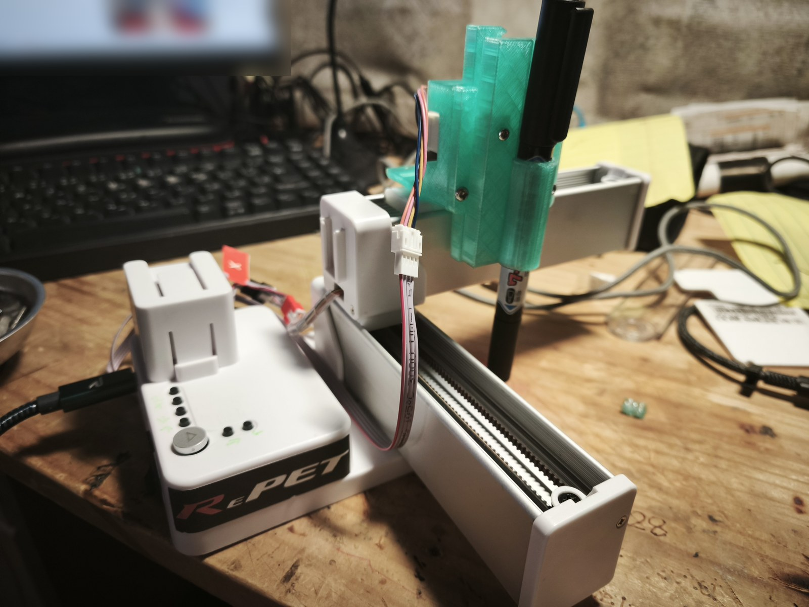
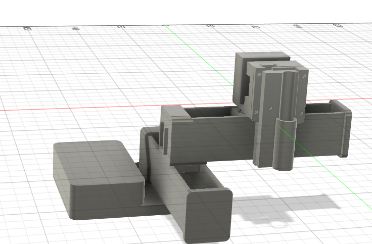

# K10 Pen Plotter

EasyThreed K10 (メイン基板 **K10 V2.1**) を、**純正基板のまま** Marlin 2.1.2.8 で動くペンプロッタに改造したプロジェクトです。
外付けのマイコンやモータードライバは使わず、基板上の GD32F303 と HR4988 をそのまま使います。

*Convert an EasyThreed K10 mini 3D printer into a pen plotter using its stock mainboard (GD32F303CBT6 + HR4988) and a custom Marlin 2.1.2.8 build.*

| 本体 | 描画結果 | ペンリフト (CAD) |
|---|---|---|
|  |  |  |

## 構成

| 軸 | 用途 | コネクタ | 備考 |
|---|---|---|---|
| X | ペン左右 | X (赤) | 606 steps/mm (純正値、実測確認済) |
| Y | 紙 (ベッド) 前後 | Y (黒) | 606 steps/mm |
| Z (論理) | ペン上下 | **E (白)** | 押出機のドライバを流用。24BYJ/28BYJ 系ギヤードステッパ + ラック&ピニオン、649 steps/mm |
| (Z) | ガントリ昇降 | Z (青) | 使わない (高さ固定、モーターは外す) |

- 描画範囲 90 × 90 mm
- 原点センサーなし。**X/Y を機構の「奥」側の端に押し当てた位置** (ペン先 = 紙の右手前の角) を基準にする
- PC との通信なし。SD カードの `plot.gco` を本体のボタンで描画する

## ハードウェア

- 基板: EasyThreed K10 V2.1 — MCU **GD32F303CBT6** (LQFP48, 128KB), ドライバ **HR4988SQ ×4**
  - 引き継ぎ情報では「GD32F103」とされていたが、実物の刻印は GD32F303CBT6 だった
- ペンリフト: [hardware/penlift](hardware/penlift)
  - `stl/` : 最終版 (V1.0) の印刷データ
  - `gears/` : ピニオン (m1, z16, 軸 φ5 2面カット) とラックの STEP と生成スクリプト
  - モーター: 24BYJ28 系 12V ギヤードステッパ (4線バイポーラで E コネクタへ)
  - フローティングペン: ラックはペンを持ち上げるだけで、下ろしたときはペンが自重で紙に乗る
- SWD 書き込み: Raspberry Pi Pico を [debugprobe](https://github.com/raspberrypi/debugprobe) にして使用
  - 基板の SD スロット横の 2×3 ヘッダ: 1 = SWDIO, 2 = 3V3, 3 = SWCLK, 4 = GND, 5 = NRST, 6 = VSSA
  - 配線: ヘッダ1 → Pico GP3, ヘッダ3 → Pico GP2, ヘッダ4 → GND (3V3 はつながない。K10 側は自前の電源で動かす)

## ピン配置 (純正ファームの解析結果)

純正ファームを SWD でダンプし、静的解析 + 動作中のレジスタ監視 (動的解析) で特定しました。詳細は [docs/pinmap.md](docs/pinmap.md)、MCU の図は [docs/mcu_pinout.svg](docs/mcu_pinout.svg)。

| 信号 | ピン |
|---|---|
| X STEP / DIR | PC15 / PC14 |
| Y STEP / DIR | PC13 / PA8 |
| Z (ガントリ) STEP / DIR | PA9 / PA10 |
| E STEP / DIR | PA11 / PA12 |
| EN (4ドライバ共通, Low で有効) | PB9 |
| モーター電流 VREF (PWM 約19.2kHz) | PB5, PB6, PB7, PB8 |
| ヒーター / ファン / サーミスタ | PB3 / PB4 (PWM) / PA2 |
| ボタン ▷ / S3 S4 S6 S7 S8 S9 | PB10 / PB0 PB1 PB12 PB13 PB14 PB15 |
| SD (SPI1) CS / 挿入検出 | PA4 / PA3 |
| ステータス LED | PA1 |

注意点:
- **USB-C にデータ線は来ていない** (PA11/PA12 は E のドライバ)。UART1 (PA9/PA10) も Z ドライバに使われている
- **VREF は MCU の PWM + RC で作っている**。ファームで PWM を出さないとモーターは動かず、High 固定だと約4A 設定になり危険
- 4つのドライバの EN は共通

## 使い方

### ファームウェアを書く
1. Pico を debugprobe 化し、SWD ヘッダに配線する
2. (推奨) 純正ファームをバックアップ: `tools/swd/dump.ps1` (フラッシュ128KB を2回読んで照合)
3. 書き込み: `tools/swd/flash_marlin.ps1` (ビルド済み `firmware/prebuilt/k10_plotter_marlin.bin` を 0x08004000 へ。純正の SD ブートローダは残る)
4. 戻すとき: `tools/swd/restore_stock.ps1 -Image <バックアップ>`

OpenOCD は [xPack OpenOCD](https://github.com/xpack-dev-tools/openocd-xpack) を使用 (PATH に置くか環境変数 `OPENOCD` にフルパス)。
自分でビルドする場合は [firmware/README.md](firmware/README.md)。

### 描く
1. 電源 OFF の状態で、X と Y を「奥」側の端まで手で押し当てる (ペン先 = 紙の右手前の角)
2. 電源 ON。S8 / S9 でペン先をちょうど紙に触れる位置まで下げ、下げる方向にもう1回押す (フローティングの余裕)
3. ▷ を押す → その位置を X90 Y0 Z0 として、SD カードのルートの `plot.gco` を描画。終わるとペンを上げて開始位置へ戻る

| ボタン | 動作 |
|---|---|
| ▷ | 現在位置を X90 Y0 Z0 にして `plot.gco` を描画 |
| S3 / S4 | X −5 / +5 mm |
| S6 / S7 | Y −5 / +5 mm |
| S8 / S9 | Z (ペン) +0.5 / −0.5 mm |

### 描画データを作る
[plots/](plots) のスクリプトを使います ([vpype](https://github.com/abey79/vpype) + vpype-gcode が必要)。

```bash
# 線画ビットマップ → センターライン SVG (輪郭の二重線にならない)
python plots/img2svg_centerline.py 画像.jpg -o 画像.svg
# SVG → K10 用 G-code (最大 90mm 角、ペン上げ Z7 / 下げ Z0、プレビュー PNG と所要時間も出力)
python plots/svg2k10.py 画像.svg -s 90 -o plot.gco
```

G-code の座標は X0..90 / Y0..90 (X+ = 紙に対して右、Y+ = 紙に対して奥)、ペン下げ `Z0`、ペン上げ `Z7`。

## ハマりどころ (記録)

- **Y とペンの軸の向き**: `INVERT_X_DIR true` / `INVERT_Y_DIR false` / `INVERT_Z_DIR false` が実機で正しかった。Y はベッドが動くので「紙から見たペンの動き」はベッドの動きと逆になる
- **脱調**: 50mm/s・加速度1000 では「ピロリリ」と鳴って脱調。20mm/s・300mm/s² に下げて解決
- **Marlin 2.1.2.8 の不具合 (STM32 / EXTRUDERS 0)** — `firmware/apply_k10.py` でパッチ
  - M907 のレポートで `SP_E_STR` 未定義
  - ユーザーボタンの初期化が AVR 流で、STM32 ではプルアップが効かない
  - `EXTRUDERS 0` だと `MOTOR_CURRENT_PWM_E_PIN` が消されるので、4本目の VREF は `MOTOR_CURRENT_PWM_XY_PIN` で出す
- **Marlin の既定タイマ**: STEP=TIM4 は VREF PWM (TIM4) と衝突するので STEP_TIMER=1 / TEMP_TIMER=2
- **vpype の `read`** は既定でページ境界で切り取るので、図とページが同寸だと縁の辺が消える → `--no-crop`
- ネット上の「K10 V2.1 = GD32F103 / MKS Robin Lite 互換」という情報は、この個体には当てはまらなかった

## 参考

- palmarci: [EasyThreed K10 3D printer main board reversing](https://palmarci.me/blog/2025-05-02-easythreed-k10-3d-printer-main-board-reversing/index.html)
- [Marlin Firmware](https://marlinfw.org/)
- [HR4988 データシート (Heroic)](https://www.heroic.com.cn/en/product/motor/motor1/hr4988-150.html)

## ライセンス

GPL-3.0 ([LICENSE](LICENSE))。ファームウェアは Marlin (GPL-3.0) の派生物です。
EasyThreed の純正ファームウェアはこのリポジトリに含まれていません。
